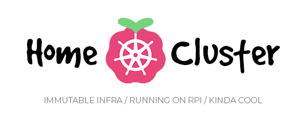

# Home Pi Cluster



An [immutable infrastructure](https://www.hashicorp.com/resources/what-is-mutable-vs-immutable-infrastructure) & [GitOps](https://www.redhat.com/en/topics/devops/what-is-gitops) approach to a home Kubernetes cluster. This is largely an experiment for fun and learning, with the following aims:

* ✅ **Immutable infrastructure**: servers should never be changed or need to be changed ater deployment of an image. That is, there should be no need to SSH in and run commands, no need to run Ansible on existing hosts, and no configuration drift: what you see is what you flashed.
* ✅ **Entirely configured in code**: the configuration of the cluster, workloads, and servers should be entirely managed by and reproducible from the code in this repo.
* ✅ **Hands-free install**: after flashing a built image to the server's USB stick/SSD, there should be no more steps required by a human whatsoever; it should simply start running the Kubernetes node with all the workloads defined in this repo.
* ⬜ **Self-upgrading**: servers should upgrade themselves automatically when a new server image is released, without the need for a human to disconnect their USB drive/SD card and reflash it.
* ✅ **Suitable for running on Raspberry Pis**: to keep power consumption low, the cluster must be capable of running solely on Raspberry Pi 3/4s.
* ⬜ **Horizontally autoscaling**: using Zigbee smart plugs, the cluster should be able to turn on/off extra nodes (Pis) automatically, as needed

<!-- TODO:

## Features

### Horizontal autoscaling

### Hybrid local and Tailscale access

### Self-upgrades

TODO: implement
When a new version of the server image is released (by pushing a Git tag with
a newer semver), nodes in the cluster will build the image from the Git source,
flash the image onto themselves (effectively nuking the entire root partition), and reboot.

This works by having _two_ root partitions: one is the active partition mounted
on the node, and the other is a 'hotswap' partition which allows the new image to be written to it for upgrades. After writing the image to the hotswap partition,
the labels on the partitions are swapped (`root` becomes `hotswap`, `hotswap` becomes `root`) and the system is rebooted.


### TLS

### Continuous deployment with ArgoCD

-->

## Prerequisites

* [QEMU](https://www.qemu.org/):

  ```console
  apt install -y \
    qemu-user-static \
    binfmt-support \
    qemu-utils
  ```

* [Packer](https://www.packer.io/)
* [Ansible](https://docs.ansible.com/ansible/latest/installation_guide/intro_installation.html#pipx-install)
* [packer-builder-arm](https://github.com/mkaczanowski/packer-builder-arm) (forked)

  ```console
  mkdir -p ~/.config/packer/plugins
  git clone https://github.com/davejbax/packer-builder-arm
  cd packer-builder-arm
  go mod download
  go build -o ~/.config/packer/plugins/packer-builder-arm
  ```

## External setup

* Tailscale
  * Follow https://tailscale.com/kb/1236/kubernetes-operator?slug=kb&slug=1236&slug=kubernetes-operator#prerequisites
* Vault
  * Make a HCP account
  * Create a Vault Secrets project

## Building

```console
foo@bar:~$ cd packer
foo@bar:~$ ./build.sh server # or 'agent' to build an agent image
```
